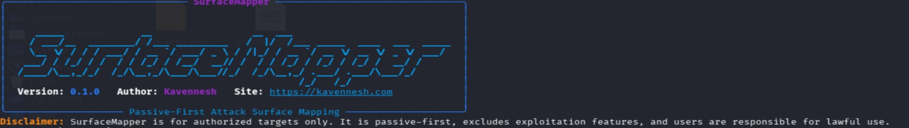

# SurfaceMapper

SurfaceMapper is a passive-first attack surface mapping CLI for authorized targets only. It helps defenders, students, and authorized security testers discover externally visible assets, inspect lightweight web metadata, and generate clean reports without crossing into exploitation or abusive scanning behavior.

**Author:** Kavennesh  
**Website:** https://kavennesh.com

## Banner Preview



## Start Here

If you just want to see it work:

```bash
surfacemapper scan example.com
```

What happens next:

- SurfaceMapper prints the project banner with your name and website
- It validates the root domain
- It gathers passive subdomains from `crt.sh`
- It resolves DNS records
- It probes lightweight HTTP and HTTPS metadata
- It saves JSON and Markdown reports in `results/`

## Ethics And Legal Notice

SurfaceMapper is for authorized targets only.

- Passive-first design
- No exploitation features
- No brute forcing
- No credential attacks
- No phishing, payload delivery, persistence, or stealth/evasion
- Users are responsible for lawful and ethical use

If you do not have explicit permission to assess a target, do not use this tool against it.

## What You Can Do

Choose the path that matches what you want:

### 1. Quick Scan

Use this when you want a fast end-to-end run with default output names:

```bash
surfacemapper scan example.com
```

Expected outputs:

- `results/example.com.json`
- `results/example.com.md`

### 2. Custom Report Names

Use this when you want your own filenames:

```bash
surfacemapper scan example.com --json client-scan.json --md client-scan.md
```

Expected outputs:

- `results/client-scan.json`
- `results/client-scan.md`

### 3. Regenerate Markdown Later

Use this when you already have JSON and want to rebuild the Markdown report:

```bash
surfacemapper report results/example.com.json --md refreshed.md
```

Expected output:

- `results/refreshed.md`

### 4. Check Installed Version

```bash
surfacemapper version
```

## Why This Project Exists

SurfaceMapper is designed to be useful without being reckless. The goal is to map external assets and surface basic exposure signals in a way that is safe to publish on GitHub, realistic for security workflows, and clear enough for defenders and students to understand.

## Core Features

- Root-domain validation and normalization
- Passive subdomain discovery through `crt.sh`
- DNS resolution for `A`, `AAAA`, `CNAME`, `MX`, and `NS`
- Safe HTTP and HTTPS probing with modest defaults
- Collection of titles, status codes, redirects, headers, and response times
- Conservative technology hints from response headers and HTML markers
- Security header checks for `Content-Security-Policy`, `Strict-Transport-Security`, `X-Frame-Options`, `X-Content-Type-Options`, `Referrer-Policy`, and `Permissions-Policy`
- Minimal exposure checks for `/admin`, `/login`, `/dashboard`, and `/wp-login.php`
- Transparent rule-based risk labels
- JSON and Markdown reports
- Rich terminal summaries

## How SurfaceMapper Thinks

The workflow is intentionally simple and transparent:

1. Validate the target domain
2. Discover passive subdomains
3. Resolve DNS safely
4. Probe HTTP and HTTPS conservatively
5. Check headers and basic technology hints
6. Look for a very small set of likely admin or login paths
7. Score findings with clear rules
8. Save results to `results/`

## Interactive Walkthrough

### Step 1. Install It

Linux and macOS:

```bash
python3 -m venv .venv
source .venv/bin/activate
python -m pip install --upgrade pip
python -m pip install -e '.[dev]'
```

Windows PowerShell:

```powershell
python -m venv .venv
.venv\Scripts\Activate.ps1
python -m pip install --upgrade pip
python -m pip install -e .[dev]
```

### Step 2. Confirm It Works

```bash
python -m pytest
surfacemapper version
```

You should see:

- the SurfaceMapper banner
- `Kavennesh`
- `https://kavennesh.com`
- the current version

### Step 3. Run Your First Scan

```bash
surfacemapper scan example.com
```

You should see:

- the disclaimer
- a terminal summary table
- saved report paths under `results/`

### Step 4. Open The Results

Look inside:

```bash
ls results
```

You'll typically find:

- one `.json` file with the full structured scan result
- one `.md` file with the human-readable report

## Example CLI Flow

```text
SurfaceMapper v0.1.0
By Kavennesh - https://kavennesh.com
Disclaimer: SurfaceMapper is for authorized targets only...
Scanning example.com...
SurfaceMapper Summary: example.com
Saved JSON report to results/example.com.json
Saved Markdown report to results/example.com.md
```

## Report Contents

Each report is designed to be readable and useful.

JSON report includes:

- target details
- discovery providers
- discovered subdomains
- DNS records
- HTTP probe results
- security header assessment
- exposure findings
- risk scoring rationale

Markdown report includes:

- target summary
- discovered assets
- DNS findings
- live web metadata
- security header results
- exposure findings
- risk summary
- methodology
- disclaimer

## Project Structure

```text
surfacemapper/
  surfacemapper/
    cli.py
    config.py
    models.py
    validators.py
    core/
    discovery/
    dns/
    probing/
    reporting/
    utils/
  tests/
  results/
```

## Architecture Notes

SurfaceMapper is built with:

- Python 3.11+
- Typer for the CLI
- Rich for terminal output
- httpx for safe HTTP probing
- dnspython for DNS lookups
- Pydantic for structured models
- Jinja2 for report rendering
- pytest for tests

Design choices:

- passive-first collection
- conservative heuristics
- explicit disclaimers
- small focused modules
- transparent rule-based scoring

## GitHub Repo Description Options

- Passive-first attack surface mapping for authorized targets only
- Safe external asset discovery and reporting for defenders and students
- Lightweight domain mapping with transparent security heuristics

## Roadmap

- Add more passive discovery providers behind a shared interface
- Add optional caching for discovery and scan reuse
- Support scan comparisons between historical runs
- Expand reporting views and filtering
- Add CSV export

## Future Improvements

- Add additional passive sources while keeping the same safe architecture
- Expand result comparison to highlight asset drift over time
- Improve reporting with better summaries and change tracking
